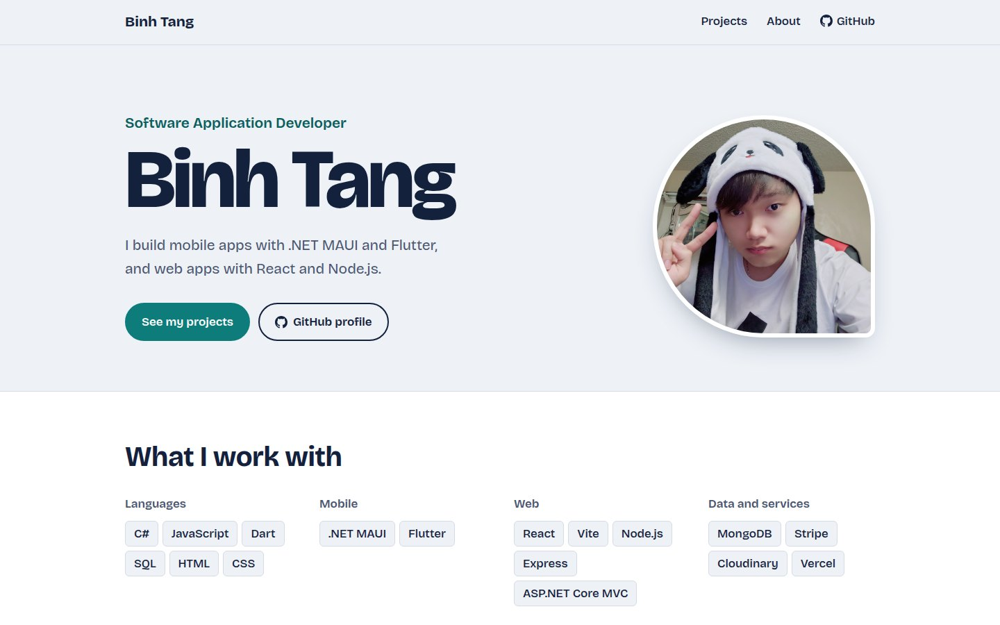
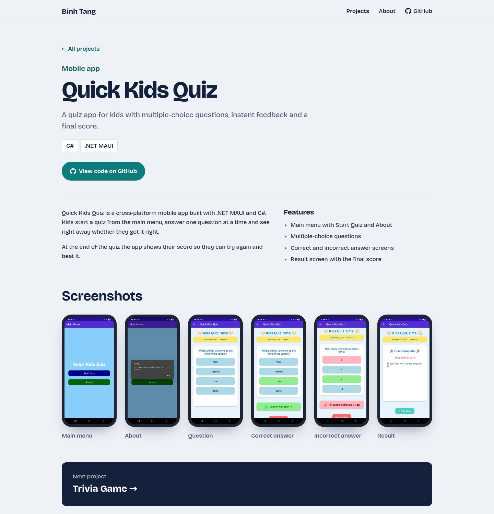

# Binh Tang — Portfolio

My personal portfolio site. It shows the apps I've built, mobile and web, with screenshots, features and links to the code.

**Live site: [portfoliobuilder-snowy.vercel.app](https://portfoliobuilder-snowy.vercel.app)**
My personal portfolio site. It shows the apps I've built, mobile and web, with screenshots, features and links to the code.

**Live site: [portfoliobuilder-snowy.vercel.app](https://portfoliobuilder-snowy.vercel.app)**



## What's inside

- **Home page.** A short intro, my skills grouped by area, and every project split into web apps and mobile apps.
- **Project pages.** A description, a feature list, the tech stack and every screenshot. Mobile screenshots sit in a phone frame and web screenshots in a browser frame. Click a screenshot to view it full size, and use the arrow keys to flip through the rest.
- **About page** and a custom 404 page.
- Works on phones, tablets and desktops, with keyboard focus styles and reduced-motion support.



## Projects featured

| Project | Type | Built with | Code |
| --- | --- | --- | --- |
| 12H Food Delivery | Web | React, Node.js, Express, MongoDB, Stripe, Cloudinary | [Repo](https://github.com/kevint1108/12H_Food_Delivery) |
| To-Do Board | Web | React, Vite | [Repo](https://github.com/kevint1108/todo) |
| Ice Cream Shopping Cart | Web | HTML, CSS, JavaScript | [Repo](https://github.com/kevint1108/Icecream-Shopping-Cart-Project) |
| Quick Kids Quiz | Mobile | C#, .NET MAUI | [Repo](https://github.com/kevint1108/Quick-Kids-Quiz) |
| Trivia Game | Mobile | Flutter, Dart | [Repo](https://github.com/kevint1108/Trivia_game) |
| Flutter Dice App | Mobile | Flutter, Dart | [Repo](https://github.com/kevint1108/Flutterproject) |

## How it's built

The site is an **ASP.NET Core MVC** app (.NET 8, C#, Razor views) with hand-written CSS and a little vanilla JavaScript. There's no CSS framework.

All content lives in a single C# file, `Data/PortfolioData.cs`. The same file feeds two versions of the site:

- **ASP.NET Core app.** Controllers pass the data to Razor views. You run this one locally with Visual Studio or `dotnet run`.
- **Static site on Vercel.** Vercel can't run .NET, so `web/build.mjs` (Node.js, no dependencies) reads `PortfolioData.cs` and the CSS, JavaScript and images from `wwwroot`, then writes plain HTML pages. Both versions look the same.

```
.
├── PortfolioBuilder-main/
│   ├── PortfolioBuilder.sln
│   └── PortfolioBuilder/              ASP.NET Core MVC app
│       ├── Controllers/               Portfolio (home, About, errors) and Project pages
│       ├── Data/PortfolioData.cs      ← all site content
│       ├── Models/                    Portfolio, Project, ProjectImage
│       ├── Views/                     Razor views and partials
│       └── wwwroot/                   CSS, JavaScript, images
├── web/build.mjs                      Static build for Vercel
├── vercel.json                        Vercel build settings and redirects
└── docs/                              Screenshots for this README
```

## Run it locally

You need the [.NET 8 SDK](https://dotnet.microsoft.com/download/dotnet/8.0).

**Visual Studio:** open `PortfolioBuilder-main/PortfolioBuilder.sln`, choose the **http** profile and press **F5**.

**Command line:**

```bash
cd PortfolioBuilder-main/PortfolioBuilder
dotnet run
```

Then open http://localhost:5166.

To preview the static version instead, you need [Node.js](https://nodejs.org) 18 or newer:

```bash
node web/build.mjs
npx serve web/dist
```

## Update the content

Edit `PortfolioBuilder-main/PortfolioBuilder/Data/PortfolioData.cs`:

- **Name, intro, About text and skills:** the fields at the top of the file.
- **Contact links:** fill in `Email`, `LinkedInUrl` or `ResumeUrl`. Empty values are hidden.
- **Add a project:** copy a `new Project { ... }` block, give it a new `Id` and `Slug`, and set `Platform` to `Mobile` or `Web`. Then list its screenshots. The first screenshot becomes the cover image.
- **Screenshots:** put them in `wwwroot/images/Project/`. File names are case-sensitive on Vercel, so they must match exactly. The build stops with an error if a listed screenshot is missing.

Push to `main` and Vercel deploys the update automatically.

## Deploy

**Vercel (static, current setup).** Import the repo on [vercel.com](https://vercel.com) and keep the default settings. `vercel.json` already sets the build command (`node web/build.mjs`), the output folder (`web/dist`), clean URLs and redirects from the old ASP.NET routes.

**ASP.NET Core app.** It can run on any host that supports .NET 8, such as Azure App Service, Render or Railway. The app reads the `PORT` environment variable when the host provides one.

```bash
cd PortfolioBuilder-main/PortfolioBuilder
dotnet publish -c Release -o out
dotnet out/PortfolioBuilder.dll
```

## Contact

- GitHub: [@kevint1108](https://github.com/kevint1108)
